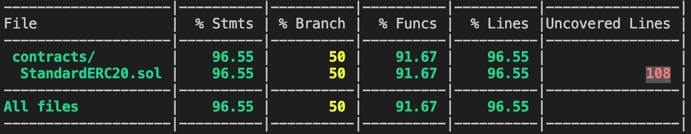

# ERC20 Contract USING TRUFFLE

## Getting Started

`$ npm install`

## Compile

`$ truffle compile`

## Run test

`$ truffle test`

## Run coverage

Add this package to your plugins array in `truffle-config.js`

```js
module.exports = {
  networks: {...},
  plugins: ["solidity-coverage"]
}
```

Run

`$ truffle run coverage [command-options]`


