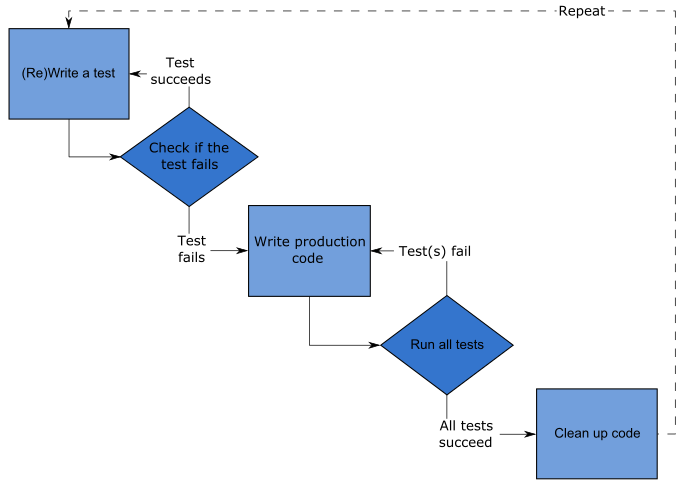
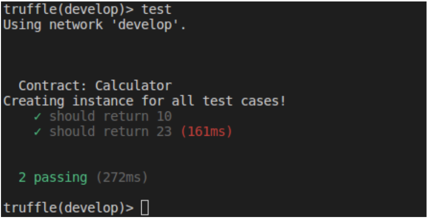

# Test Driven Development in blockchain using Truffle

- Writing test cases before the code. But not all test cases before. Its should be repetitive process. Test case :arrow_right code :arrow_right: test cases, like that.
- Means that not writing all of the tests and then all of the code. Start by writing just one test and
  then some code, enough code to pass. And repeate.
- Key to uint test to **‘Test the unit in isolation!’**

These tests are unit test, nothing to do with the whole system, rather check the functionality of just one unit.

Three rules of TDD

- You are not allowed to write any production code unless it is to make a failing unit test pass.
- Meaning you should first test case before any production code and that test should fail.
- You are not allowed to write any more of a unit test than is sufficient to fail; and compilation failures are failures.
  - Meaning you should stop writing any further test case if your test case fail. So the moment your test case fails, you should stop writing the more test case, and start working on production code. And also, even if compiling of test case fails, stop wrting more test cases.
- You are not allowed to write any more production code than is sufficient to pass the one failing unit test.

Test-Driven development is a process of developing and running automated test before actual development of the application. Hence, TDD sometimes also called as **Test First Development**.

### How to perform TDD Test

Following steps define how to perform TDD test,

1. Add a test.
2. Run all tests and see if any new test fails.
3. Write some code.
4. Run tests and Refactor code.
5. Repeat

Mocha : a testing framework
Chai : an assertion library (optional)



Steps need to be taken

1. `truffle init`
2. `truffle develop`
3. First add test case file - create test &lt;Name of the contract&gt;. Here take example of a ballot contract. So **create test Calculator**

   a. After execution of this command, notice calculator.js file gets created in test folder.

4. Open the `calculator.js` file in test folder, and update the code like this.

```js
const Calculator = artifacts.require("./Calculator.sol");
contract("Calculator", (accounts) => {
  it("should assert true", function (done) {
    const calculator = Calculator.deployed();
    assert.isTrue(true);
    done();
  });
});
```

5. Run the test `test ./test/calculator.js`

   a. Of course it will fail since we have not written any code so far.

6. Next we will code the contract. Go to contract folder and create `Calculator.sol` file and add the following code.

```js
// SPDX-License-Identifier: MIT

pragma solidity ^0.6.0;

    contract Calculator {
        uint number;

        constructor(uint val) public {
            number = val;
        }
    }
```

7. Lets create a migration file now. Go to truffle console, and run command : `create migration <name of the migration file>` . E.g `create migration deploy_contract`
   a. This will create a file under migrations folder. Notice the file name is prepended with time stamp. You can change it to something else, if you want. Rename to `2_deploy_contract.js`

8. Now open `2_deploy_contract.js` under migration folder and add following code

```js
const Calculator = artifacts.require("./Calculator.sol");

module.exports = function (deployer) {
  deployer.deploy(Calculator, 10);
};
```

9. In truffle console, compile and migrate the contract.
10. Re-run the test again. And this time it should pass, since we have deployed our contract in previous step.
11. Similarly we can keep adding test cases and adding the code in contract.

add the following code to `Calculator.sol`

```js
// SPDX-License-Identifier: MIT

pragma solidity ^0.6.0;

contract Calculator {
    uint number;

        constructor(uint val) public {
            number = val;
        }

        function getVal() public view returns(uint) {
            return number;
        }

        function addNumber(uint val) public {
            number += val;
        }

        function subNumber(uint val) public {
            number -= val;
        }
}
```

Test Cases using promise

```js
const Calculator = artifacts.require("./Calculator");

contract("Calculator", (accounts) => {
  let contractInstance;
  // Create instance before all est cases
  before(() => {
    Calculator.deployed().then((calInstance) => {
      contractInstance = calInstance;
      console.log("Creating instance for all test cases");
    });
  });

  it("should return 10", () => {
    contractInstance.getVal.call().then((result) => {
      assert.equal(result.valueOf(), 10, "Test failed : should return 10");
    });
  });

  it("should return 23", () => {
    contractInstance.addNumber(10);
    contractInstance.subNumber(7);
    contractInstance.getVal
      .call()
      .then((result) => {
        assert.equal(result.valueOf(), 13, "Test failed : should return 13");
        contractInstance.addNumber(10);
        return contractInstance.getVal.call();
      })
      .then((result) => {
        assert.equal(result.valueOf(), 23, "Test failed : should return 23");
      });
  });
});
```

And we can always simplify our code structure using Async-Await.

```js
// Using async-await

const Calculator = artifacts.require("Calculator");

contract("Calculator", (accounts) => {
  let contractInstance;

  before(async () => {
    contractInstance = await Calculator.new(10);
    console.log("Creating instances for all test cases!");
  });

  it("should return 10", async () => {
    const result = await contractInstance.getVal.call();
    assert.equal(await result.valueOf(), 10, "Test failed : should return 10");
  });

  it("should return 23", async () => {
    contractInstance.addNumber(10);
    contractInstance.subNumber(7);
    let result = await contractInstance.getVal.call();
    assert.equal(result.valueOf(), 13, "Test failed : should return 13");
    await contractInstance.addNumber(10);
    result = await contractInstance.getVal.call();
    assert.equal(result.valueOf(), 23, "Test failed : should return 23");
  });
});
```

Output :



Summary:

- Test driven development is a process of modifying code in order to pass a test designed previously.
- It more emphasis on production code rather than test case design.
- It is sometimes known as &quot;Test First Development.&quot;
- TDD includes refactoring a code i.e. changing/adding some amount of code to
  the existing code without affecting the behavior of the code.
- TDD when used, the code becomes clearer and simple to understand.

Truffle uses the [Mocha](https://mochajs.org/) testing framework as well as [Chai](https://www.chaijs.com/) assertion library under the hood.
